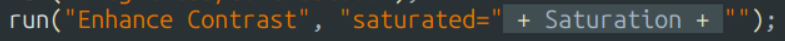
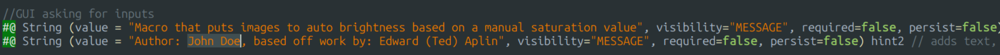

# Fiji Macro Toolkit

-   [About](#about)
    -   [macros included](#macros-included)
-   [Installation](#installation)
-   [Using Macros](#using-macros)
-   [Creating your own Macros](#creating-your-own-macros)
    -   [Using the templates: example of brightness and contrast](#using-the-templates:-example-of-brightness-and-contrast)

## About

This is a set of ImageJ macros for completing commonly used ImageJ functions on an entire folder of images.

Batch processing macros are an important aspect of any kind of experiment with multiple Images present for a number of reasons. - It is faster - Allows for other work to be done while it runs in the background - Massively reduces the chance of error - Ensures that all files are correctly processed in the same way - Makes your workflow substantially more reproducible and transparent

The aim of this project is to have a robust toolkit which is easy to use for even those with no ImageJ experience and can compute large volumes of images even with limited computational power.

I have also added templates which can be used to create your own macros from with instructions at the bottom. I hope this will allow people who have never used ImageJ macros before to be able to produce their own batch processing macros.

They all work on Windows and Linux, and should work on Mac too, but I have not had the opportunity to test this.

Most of these Macros only work with .tif input files, but there is a macro to convert images from other proprietary formats to .tif and one of the macro templates contains this functionality.

### Macros included

1.  Add scale bar.ijm
    -   Adds a scale bar onto TIFF files in folder
    -   can define the size, direction and colour scheme
    -   units is always defined by the Image
2.  Check Plugins.ijm
    -   Checks whether you are missing any plugins required for other macros
    -   returns any which you are missing
3.  Compress Files.ijm
    -   Uses average pixel binning to compress TIFF files
    -   Either automatically compresses all files to be below 4GB
    -   or compresses files based on manual parameters
4.  Export as TIFF.ijm
    -   takes each image stored in a proprietary file type and converts them to TIFFs
5.  Measure ROIs.ijm
    -   Measures the mean intensity of all ROIS in the image and saves as a .csv
    -   ensures that all ROIs are measured and the mean is measured
    -   ensures that it is saved in the correct format for 2t2c <https://github.com/TedAplin/2T2C>
    -   doesn't work in batch
6.  Merge Channels.ijm
    -   Merges together channels in the order requested by user
7.  Save video as AVI.ijm
    -   saves a .avi formatted video of all tiffs in a folder
    -   Allows the user to specify channels used and FPS
    -   Allows for Z projection of auto brightness/ contrast to be run during the process
8.  Set Brightness and Contrast.ijm
    -   Lets the user set the brightness and contrast of their TIFF files
    -   can use auto brightness and contrast
    -   can manually enter minimum and maximum intensity values for consistency
9.  Tiff stabilisation.ijm
    -   uses "correct 3d drift" to stabilise TIFF time series
    -   users can select which channel to use, and how much to stabilise
    -   only works with files \< 4GB
10. Z project.ijm
    -   Runs Z project on all TIFF files
    -   User can select which method to use

## Installation

1.  Go to the v1.0 Release (red square on Github Repository)

2.  Download the Source code as a .zip (or tar.gz if you prefer)

3.  Extract the .zip folder to wherever you want the files

## using Macros

1.  Drag and drop the macro file onto your ImageJ window:

2.  click "run" in the bottom left

3.  Fill in the required parameters then press OK to run the macro

## Creating your own Macros

In the repository there is a folder called "Templates", this contains files for making your own Macros in the same format as mine, but for different functions. The template contains all the code for working with photos in batch from a folder, then there is a free space for you to put in the function of the macro.

#### The built in functions of the templates are:

-   Creates a GUI asking for use Inputs

-   Opens up a selected folder and create a list of relevant files

-   Opens each file in this list

-   *space for user input*

-   Renames the file and saves to selected folder

-   Gives simple updates throughout

#### There are two different files:

1.  Template Macro for all file types.ijm
    -   Works with TIFF and proprietary files
    -   You can select which file types to process
    -   May remove extra data from TIFFs such as overlays
2.  Template Macro for TIFF files.ijm
    -   Has the best compatability with all Image features
    -   Best to use this template unless you need support for other filetypes

### Using the templates: example of brightness and contrast

#### Recording Macro activity

The first thing you need to do is get the code for the process you want the macro to complete.

The easiest way to do this is using the "Record Macro" tool which shows you the code for any action you manually complete.

1.  Open an image
2.  In Image J go to Plugins \> Macros \> Record...

This will open a new "recording" window which should be empty

3.  You can go back to the window of your image and complete whatever task (in this case adjusting brightness and contrast)

Once you have done this there will be code in the "recorder" window

4.  Copy and paste the necessary code from the "recorder" window to the marked location in the template

5.  add a file name addition in the "renaming title" section

6.  Edit the GUI code at the top of the document to ask for what you need (if required

In this case I wanted to ask for saturation, so firstly I need to change the saturation value to a variable instead of a fixed value.

First, highlight the fixed value, press the quotation mark button then backspace.

This opens up a gap in the fixed text in which you can put in a variable name surrounded by 2 plusses, like this:

Then you need to take the pre-made entry code at the top of the document and change the label and the name of the stored variable (word at the end of the line) accordingly.

You should remove any lines of the GUI code which you are not using, but it shouldn't break if you don't

7.  Edit the Text at the top of the GUI to include your name and an explanation of the macro

8.  save and bug test!

Hopefully there shouldn't be any bugs, but I can't promise anything

**If you follow these steps then you can create a functioning macro that looks like this:**

